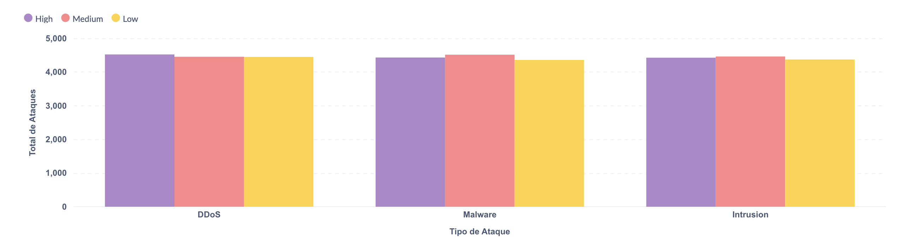
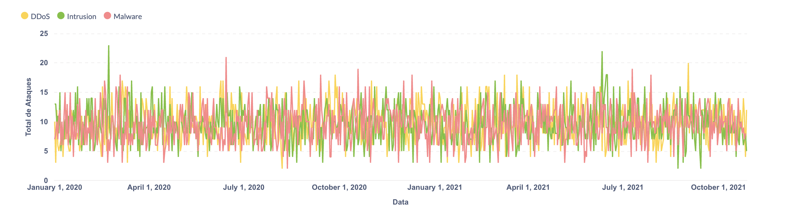

# Análise de Ataques de Cibersegurança

Este projeto realiza uma análise ETL de um dataset de ataques de cibersegurança, utilizando PostgreSQL como Data Warehouse e Metabase para visualização.

## Estrutura do Projeto

- `etl/`: Scripts de extração, transformação e carregamento
  - `download_data.py`: Script para carregar dataset local
  - `load_to_postgres.py`: Script para carregar dados no PostgreSQL
  - `normalize_dimensions.py`: Script para normalizar as dimensões
- `data/`: Pasta para armazenamento dos dados brutos
- `visualizations/`: Imagens das visualizações geradas
- `config/`: Configurações do projeto

## Requisitos

- Python 3.8+
- Docker Desktop
- Dependências Python listadas em `requirements.txt`

## Instalação e Configuração

1. Clone o repositório
2. Instale as dependências Python:
```bash
pip install -r requirements.txt
```

3. Configure as variáveis de ambiente:
   - Copie o arquivo `.env.example` para `.env`
   - Edite o arquivo `.env` com suas configurações específicas

## Gerenciamento dos Containers

### Primeira Execução

1. Criar rede Docker para os containers:
```bash
docker network create cybersecurity-network
```

2. Iniciar PostgreSQL:
```bash
docker run --name postgres-cybersecurity \
  --network cybersecurity-network \
  -e POSTGRES_PASSWORD=${POSTGRES_PASSWORD} \
  -p ${POSTGRES_PORT}:5432 \
  -d postgres
```

3. Criar banco de dados:
```bash
docker exec -it postgres-cybersecurity psql -U ${POSTGRES_USER} -c "CREATE DATABASE ${POSTGRES_DB};"
```

4. Iniciar Metabase:
```bash
docker run -d \
  -p 3000:3000 \
  --name metabase-cybersecurity \
  --network cybersecurity-network \
  metabase/metabase
```

### Gerenciamento Diário

Para parar os containers (liberar as portas):
```bash
docker stop postgres-cybersecurity metabase-cybersecurity
```

Para reiniciar os containers:
```bash
docker start postgres-cybersecurity metabase-cybersecurity
```

Para remover os containers (caso necessário):
```bash
docker rm -f postgres-cybersecurity metabase-cybersecurity
```

## Execução do ETL

1. Coloque o arquivo CSV na pasta `data/`:
```bash
# Certifique-se que o arquivo está em:
data/cybersecurity_attacks.csv
```

2. Execute os scripts ETL:
```bash
# Verificar se o arquivo está correto
python etl/download_data.py

# Carregar dados no PostgreSQL
python etl/load_to_postgres.py

# Normalizar dimensões
python etl/normalize_dimensions.py
```

## Visualizações no Metabase

1. Acesse o Metabase: http://localhost:3000

2. Configure a conexão com o PostgreSQL:
   - Host: ${POSTGRES_HOST}
   - Port: ${POSTGRES_PORT}
   - Database: ${POSTGRES_DB}
   - Username: ${POSTGRES_USER}
   - Password: ${POSTGRES_PASSWORD}

3. Crie as visualizações usando as queries:

### Visualização 1: Distribuição de Ataques por Tipo e Severidade
```sql
SELECT
    at.attack_type as "Tipo de Ataque",
    s.severity as "Nível de Severidade",
    COUNT(*) as "Total de Ataques"
FROM raw_cybersecurity_attacks r
JOIN dim_attack_type at ON r."Attack Type" = at.attack_type
JOIN dim_severity s ON r."Severity Level" = s.severity
GROUP BY at.attack_type, s.severity
ORDER BY COUNT(*) DESC;
```

### Visualização 2: Análise Temporal dos Ataques
```sql
SELECT 
    DATE_TRUNC('day', t.timestamp) as "Data",
    at.attack_type as "Tipo de Ataque",
    COUNT(*) as "Total de Ataques"
FROM raw_cybersecurity_attacks r
JOIN dim_attack_type at ON r."Attack Type" = at.attack_type
JOIN dim_timestamp t ON r."Timestamp"::timestamp = t.timestamp
GROUP BY DATE_TRUNC('day', t.timestamp), at.attack_type
ORDER BY "Data";
```

## Visualizações Geradas

### Distribuição de Ataques


### Análise Temporal


## Dimensões Analisadas

- attack_type: Tipo do ataque
- severity: Nível de severidade do ataque
- destination_port: Porta de destino
- timestamp: Data e hora do ataque